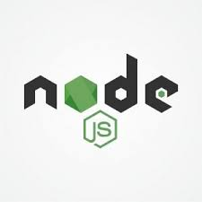

                                              Hi 👋, I'm Rudro Debnath
                                   PortFolio: https://rudro-25.github.io/Portfolio_Rudro25/

        

  

  
  
  
  
  

<!-- 
  
 -->

## About Me

Software Engineer at **AppsCode Inc.** with 1.5 years of professional experience, starting in April 2024. I specialize in Kubernetes and cloud-native technologies, contributing to projects like the KubeDB operator and Cluster API for multi-cloud management. My background includes competitive programming, achieving top-20 ranks and working as a problem setter/tester for platforms like Codeforces and CodeChef. Passionate about building robust, scalable backend systems.

### Skills

**Languages & Databases:** Go, C++, Python, MongoDB  
**Cloud & DevOps:** Kubernetes, Docker, AWS, Azure, GCP, Cluster API, vCluster, KubeDB, Linux  
**Observability & Monitoring:** Prometheus, Grafana  
**Platforms & Tools:** etcd, HashiCorp Vault, REST APIs, Controller-Runtime, Operator SDK  
**CI/CD & Tooling:** Git, GitHub Actions, Makefile  
**Concepts:** Kubernetes Operators, Custom Resource Definitions (CRDs), System Design, Distributed Systems, Database Lifecycle Management, Day-2 Operations

## Work Experience

**Software Engineer** — AppsCode Inc. (Dhaka, Bangladesh)  
April 2024 – Present

**Kubernetes Operator Development:**
- Enhanced and maintained the **ZooKeeper operator** in KubeDB, improving database controller reliability and performance
- Developed the **Ops Manager** component from scratch, enabling automated Day-2 operations including version upgrades, horizontal/vertical scaling, and volume expansion for stateful database workloads
- **Technologies:** Go, Kubernetes Operator SDK, Controller-Runtime, StatefulSets, Custom Resource Definitions (CRDs)

**Cluster Lifecycle Management:**
- Designed and implemented **cluster version upgrade workflow** for managed Kubernetes clusters across AWS, Azure, and GCP using Cluster API
- Leveraged **vCluster** technology to enable seamless control plane upgrades while abstracting cloud-specific complexities
- **Technologies:** Cluster API, vCluster, Go, AWS EKS, Azure AKS, Google GKE, Kubernetes

**Secrets Management & Security:**
- Developed **Virtual Secrets** project - a Kubernetes Extended API resource that integrates with external secret managers (HashiCorp Vault, AWS/Azure/GCP Secret Manager)
- Implemented secure secret handling by storing sensitive data in external vaults while keeping metadata in-cluster for performance
- Enhanced Kubernetes security by eliminating plain-text secret storage in etcd
- **Technologies:** Go, Kubernetes API Extension, HashiCorp Vault, AWS Secrets Manager, Azure Key Vault, GCP Secret Manager

## Personal Projects

**Restaurant Management System**  
2025
- Developed complete backend API server with user authentication, menu management, order processing, and table reservations  
- **Technologies:** Go, MongoDB, REST APIs, JWT Authentication, CRUD Operations

**Hotel Booking Application**  
2024  
- Built full-stack platform with user authentication, hotel management, image uploads, search/filtering, and online payments  
- **Technologies:** MongoDB, Express, React, Node.js, TypeScript, Tailwind CSS, REST APIs, JWT
  
**Rare Medicine Finder**  
2021  
- Created web application to help users locate rare medicines by searching and displaying exact pharmacy locations  
- **Technologies:** HTML, CSS, JavaScript, React, REST APIs

**Dijkstra Algorithm Visualizer**  
2022  
- Built interactive tool that visualizes Dijkstra's shortest path algorithm with real-time animations and custom graphs  
- **Technologies:** HTML, CSS, JavaScript, Canvas API, Data Structures & Algorithms

**Code Similarity Detection using GNN**  
2023  
- Implemented code similarity analysis system using Graph Neural Networks combined with edit distance algorithms  
- **Technologies:** Python, PyTorch, Graph Neural Networks, Edit Distance Algorithm, Machine Learning

## Education

**University of Barishal** — Bachelor of Science in Computer Science & Engineering  
Jan 2018 – Mar 2024 | CGPA: 3.58/4.0

## Achievements

**Competitive Programming & Hackathons:**
- **IUPCs:** 15th in BUET IUPC 2022, 17th in SUST IUPC 2023, 21st in CoU IUPC 2023
- **ICPC:** Honorable Mention in ICPC Asia Dhaka Regional (2021, 2022, 2023, 2024)
- **Hackathons:** Finalist in Code Samurai 2024 & BUET Hackathon (Top 15 - DevOps)

**Online Programming Platforms:**
- **CodeForces:** Expert (Max Rating: 1882), Best Global Rank: 108th
- **LeetCode:** Knight (Rating: 2159, Top 1.32%), Best Global Rank: 107th
- **Meta Hacker Cup 2022:** Round 3 Qualifier (Top 1000 globally)
- **CodeChef:** 5-star (Rating: 2043), Best Global Rank: 19th 

#### Connect With Me

 
 

  
   
  
  
  
  
  

#### Languages and Tools:

         

#### Development Stuffs:

<b>⚡ Github Stats</b>

 

<!-- <b>&#128200; Competitive Programming</b>

<!-- ### ACTIVITY GRAPH TRACKER 
   -->

### GitHub Streak

